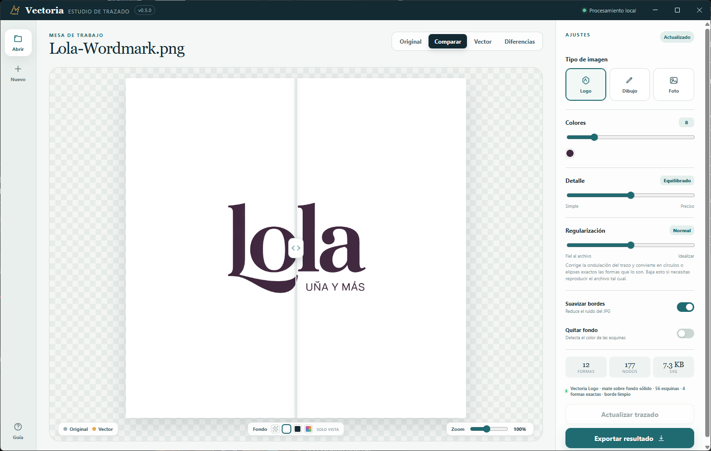

# Vectoria

Aplicación de escritorio para convertir imágenes JPG, PNG, BMP, GIF y WebP en vectores editables. Todo el procesamiento se realiza localmente.



El modo **Logo** detecta automáticamente los archivos que son un logo de tintas planas —con transparencia, sobre fondo sólido, y de una o varias tintas— y los trata con un motor propio pensado para tipografía. Las ilustraciones y fotografías siguen usando VTracer.

## Cómo funciona el motor de logos

1. **Resolución de trabajo.** Antes de trazar, la imagen se lleva a unos 1800 px de lado mayor con un núcleo de reconstrucción Mitchell (ampliar) o Lanczos-3 (reducir), con alfa premultiplicado. Las ampliaciones se redondean a factor entero para no introducir fase fraccionaria en los bordes rectos. Un logo pequeño trazado a resolución nativa tiene el antialias comprimido en un solo píxel, y ahí es donde se pierden las astas finas y los contrapuntos.
2. **Campo de cobertura.** Con transparencia se usa el canal alfa, que ya es cobertura de área. Sin transparencia se estima el color de fondo y se proyecta cada píxel sobre el eje fondo-tinta, lo que da un umbral sin sesgo hacia astas más gruesas o más delgadas.
3. **Contorno subpíxel.** Marching squares con interpolación, enlazado de segmentos que resuelve las celdas ambiguas por continuidad de dirección y no descarta contornos abiertos.
4. **Esquinas.** Detector en dos escalas: la corta localiza el vértice, la larga distingue una esquina real de una curva cerrada comparando cómo crece el giro entre ambas. El vértice se lleva a la intersección de las dos rectas ajustadas a cada lado, porque el antialias redondea la esquina del ráster y el vértice real no cae en ninguna muestra.
5. **Autocalibrado según la calidad del archivo.** Antes de ajustar, se mide el ruido de extracción del contorno con un filtro cuadrático local, que absorbe la curvatura real y deja solo el temblor de muestreo. Un PNG con antialias correcto ronda 0,038 px; uno con el borde casi duro pasa de 0,10 px. La tolerancia y el alisado se escalan con esa medida, y la tolerancia nunca baja de 3,5 veces el ruido.
6. **Alisado.** Convolución gaussiana a lo largo del arco con sigma en píxeles de la imagen original, anulada en las esquinas.
7. **Regularización.** Se alisa la dirección de la tangente a lo largo del arco con un ajuste cuadrático local y se reconstruye el contorno integrándola, por tramos entre esquinas y con un presupuesto máximo de desviación. Después, los contornos que son círculos o elipses se sustituyen por la forma exacta.
8. **Tramos rectos.** Se buscan los lados rectos del contorno aparte de las esquinas y se emiten como rectas exactas; el hueco entre dos de ellos —el vértice redondeado— se ajusta con curvas tangentes a ambas. Sin esto, una forma geométrica con vértices redondeados no tiene ninguna esquina que detectar y todo su perímetro, recto en un 99%, se ajustaba como curva continua.
9. **Ajuste de curvas.** Lo que no es recto se parte en las esquinas y cada tramo se ajusta con tangentes de un solo lado, de modo que los vértices quedan vivos.
10. **Eliminación de nodos.** El ajuste recursivo parte por la mitad en cuanto el error se pasa y nunca vuelve atrás, así que cada partición deja un nodo permanente aunque después resulte innecesario. Una pasada posterior intenta borrar cada unión y reajustar el tramo unido, quedándose con el borrado sólo si el error sigue dentro de tolerancia.

### Por qué la fidelidad no es el objetivo

Los pasos 1 a 6 persiguen parecerse al ráster. Para un logo eso está mal planteado: nadie quiere una copia exacta de los artefactos de un PNG mal exportado, quiere la forma que el diseñador dibujó. Medido sobre un logo caligráfico real, la ondulación del trazo de nuestra salida era prácticamente la misma que la del archivo de partida — reproducción fiel de un original irregular.

Por eso existe el paso 7, que se aparta del ráster a propósito. El control **Regularización** decide cuánto:

- **Ninguna** reproduce el archivo tal cual. Es lo que quieres en un plano técnico, donde cada ondulación puede ser real.
- **Normal** es el valor por defecto en el modo Logo.
- **Máxima** idealiza al máximo: conviene en logos escaneados o muy comprimidos.

Dos detalles del método que costaron encontrar:

- Se alisa **el ángulo de la tangente**, no las posiciones. Alisar posiciones encoge la figura porque tira de cada punto hacia la cuerda de sus vecinos; alisar el ángulo conserva la longitud de los tramos y el giro total.
- Se usa un **ajuste cuadrático local**, no una gaussiana. Una gaussiana atenúa toda la variación del ángulo, incluida la legítima, y convierte las elipses en algo más parecido a un círculo. Se detectó midiendo sobre una elipse matemáticamente perfecta, donde perdía fidelidad en lugar de ganarla.

Sobre el logo caligráfico real, la regularización por defecto baja de 397 a 306 nodos y de 14,5 a 11,9 KB, reduce la aspereza de curvatura un 7% y convierte los puntos de las íes en círculos exactos.

### Trazos finos

Toda operación con radio de acción —alisado, regularización, refinado de esquinas— tiene que limitarse al grosor de lo que está tocando. Un asta de 26 px y una de 2 px no admiten el mismo radio: sobre la fina, alisar mezcla los dos lados del trazo a través de su propio grosor.

Cada contorno estima su grosor característico como el doble de su área dividida entre su perímetro, y ajusta con eso el radio de alisado, el presupuesto de regularización y el desplazamiento máximo de un vértice. Sin ese límite, medido sobre un logotipo con texto de 2,2 px de asta: la regularización engordaba las astas un 14% y el refinado de esquinas, con 3 px de margen sobre un trazo de 2 px, sacaba picos en las letras. Con el límite, el área de tinta del texto queda a un 0,8% de la real.

Además, la regularización iguala el grosor donde debería ser constante. Para cada punto se busca el punto de enfrente del trazo, midiendo la anchura local a lo largo de todo el contorno, y se corrige hacia ella. Tres cautelas que costaron encontrar:

- El objetivo es **local**, no un grosor único: un anillo elíptico es más ancho en un eje que en otro y una didona alterna asta gruesa y fina. Forzar un valor global destruía esos diseños.
- Se comparan **dos escalas de alisado del perfil de anchuras**, no la medida cruda. La medida cruda es un mínimo sobre muestras discretas y salta; corregir contra ella inyectaba ese salto en la geometría y convertía un contorno de seis rectas en uno de 151 puntos ondulados.
- La zona válida se **erosiona** antes de aplicar nada, porque junto a un remate o una unión las ventanas de alisado mezclan datos con huecos y generan correcciones que no corresponden a ninguna ondulación real.

Medido sobre el texto pequeño de un logotipo real, la variación de grosor dentro de cada asta baja del 18,96% que trae el ráster al 9,33%.

### Qué llega a Illustrator

El SVG sale pensado para editarse, no solo para verse:

- **Un objeto por letra o forma**, con sus contrapuntos dentro y agrupado por tinta. Puedes coger una letra y moverla, y su contrapunto va con ella, sin soltar ningún trazado compuesto.
- **Círculos y elipses** salen como `<circle>` y `<ellipse>`, que Illustrator abre como objetos elipse vivos.
- Los vértices son puntos de esquina de verdad y los tramos rectos son segmentos rectos, así que se mantienen rectos al editar.
- Recuento de nodos bajo: entre 33 y 195 para logotipos completos.

### Ver dónde falla

La pestaña **Diferencias** del visor pinta en rojo la tinta que el trazado añade y en naranja la que le falta. Es la misma herramienta con la que se encontraron casi todos los defectos del motor, y estando dentro de la aplicación permite juzgar un archivo raro sin depender de un análisis externo.

### Por qué el autocalibrado importa

Es la corrección menos evidente y una de las que más se notan. Con una tolerancia fija y estricta, en un archivo cuyo borde viene escalonado el ajuste deja de seguir la curva y **se pone a seguir la escalera de píxeles**. El parecido medido sube, porque reproduce fielmente los escalones, pero el resultado es peor: contornos dentados y muchísimos nodos.

Sobre un logo caligráfico real de 585 px con el borde casi duro, el mismo trazado con tolerancia fija de 0,25 px daba **1.053 nodos y 35 KB**; autocalibrado da **397 nodos y 14,5 KB** y sigue la curva que se pretendía dibujar.

La barra inferior informa de la calidad detectada — "borde limpio", "borde irregular" o "borde duro". Si sale "borde duro", el límite ya no está en el trazador sino en el archivo de partida: conviene conseguir el original en mayor resolución.

## Verificar la calidad

- `npm.cmd run check` ejecuta la comprobación de estructura y las pruebas de geometría.
- `npm.cmd run bench` mide **fidelidad de área** (IoU), **aspereza de curvatura**, desvío en los vértices y número de comandos sobre formas sintéticas con antialias exacto. Las dos primeras hay que leerlas juntas: la fidelidad sola premia reproducir los defectos del archivo, así que por sí misma apunta en la dirección equivocada para un logo. Variables de entorno `DETAIL` y `REGULARIZE` para barrer los perfiles. Aceptando la ruta de otro motor como argumento, compara ambos:

```
node scripts/benchmark-tracer.cjs ruta/al/otro/logo-tracer.js
```

Medidas actuales frente al motor anterior, perfil Equilibrado:

| Forma | IoU antes | IoU ahora | Desvío en vértice antes | Ahora | Comandos antes | Ahora |
| --- | --- | --- | --- | --- | --- | --- |
| Cuadrado girado | 0,99517 | 0,99970 | 0,562 px | 0,020 px | 14 | 4 |
| Letra con asta y contrapunto | 0,96689 | 0,99392 | 0,544 px | 0,000 px | 18 | 14 |
| Estrella de 5 puntas | 0,99061 | 0,99877 | 1,418 px | 0,019 px | 32 | 10 |
| Elipse | 0,99490 | 0,99650 | — | — | 6 | 4 |

## Ejecutar

1. Abre PowerShell en esta carpeta.
2. Ejecuta `npm.cmd start`.
3. Arrastra una imagen o pulsa **Elegir imagen**.
4. Ajusta colores, detalle y limpieza; luego pulsa **Actualizar trazado**.
5. Exporta como SVG o PDF vectorial.

La barra inferior permite cambiar el fondo de previsualización entre transparencia, claro, oscuro o un color personalizado. Este color sirve únicamente para revisar diseños claros u oscuros y nunca se agrega al archivo exportado.

También puedes iniciar la aplicación con doble clic en `Iniciar Vectoria.cmd`.

## Consejos

- Para logos, un PNG grande y sin compresión ofrece el mejor resultado, pero el motor ya no depende de que lo sea: amplía internamente los archivos pequeños antes de trazar.
- Los logos blancos con transparencia activan automáticamente un fondo oscuro para que puedan verse.
- Usa pocos colores para obtener formas más fáciles de editar.
- **Equilibrado** es el perfil recomendado para logos y tipografía. **Preciso** afina la tolerancia por debajo del ruido de extracción del ráster, así que conserva algo más de detalle a cambio de bastantes más nodos.
- SVG es el formato recomendado para continuar el trabajo en Adobe Illustrator.

## Alcance de esta versión

Esta versión incluye trazado multicolor con VTracer, motor propio para logos de una tinta (con y sin transparencia), limpieza de fondo, comparación interactiva, tres perfiles y exportación SVG/PDF. ImageTracerJS se conserva como respaldo automático.

Pendiente para una fase posterior:

- **Tintas que comparten borde.** El trazado por tintas funciona mientras cada una tenga su propio contorno. Cuando dos colores se tocan haría falta una topología común para que no queden ni huecos ni solapes en la costura.
- **Enderezado de astas.** Alinear a la vertical o la horizontal exactas los tramos que ya casi lo están, reajustando los vértices compartidos. Es lo que separa un trazado limpio de uno con astas ligeramente inclinadas.
- **Detección de círculos y arcos**, para que una circunferencia salga como tal y no como cuatro cúbicas ajustadas.
- **Edición manual de nodos y regiones.**

## Desarrollo

El proyecto está versionado con git y sigue [SemVer](https://semver.org/lang/es/). El historial de cambios, con las medidas de cada fase, está en [CHANGELOG.md](CHANGELOG.md). La versión instalada aparece en la esquina superior izquierda de la aplicación.

Antes de dar por bueno un cambio en el motor:

```
npm.cmd run check     # estructura y pruebas de geometría
npm.cmd run bench     # fidelidad, aspereza de curvatura, nodos
```

### Publicar en GitHub

El repositorio local ya está creado, con el primer commit y la etiqueta `v0.3.0`. Para subirlo hace falta autenticarte tú, así que estos comandos van en tu PowerShell:

```powershell
cd C:\Vector

# Opción A: con GitHub CLI (crea el repositorio y sube en un paso)
gh repo create vectoria --private --source=. --push

# Opción B: creando el repositorio a mano en github.com y luego
git remote add origin https://github.com/TU-USUARIO/vectoria.git
git push -u origin main --tags
```

### Para la siguiente versión

```powershell
npm.cmd version minor      # sube el número en package.json y crea la etiqueta
git push --follow-tags
```

Conviene anotar en el CHANGELOG qué cambió y **con qué medida se comprobó**, no solo qué se tocó.

## Privacidad

Vectoria no sube imágenes ni resultados a servicios externos. La imagen se procesa dentro de la aplicación y solamente se escribe al disco cuando eliges una ubicación de exportación.

## Licencia

Este proyecto se distribuye bajo la [PolyForm Strict License 1.0.0](LICENSE): el código es público para leerlo, estudiarlo y usarlo con fines no comerciales, pero no permite distribuirlo, modificarlo ni usarlo comercialmente sin permiso del autor.
